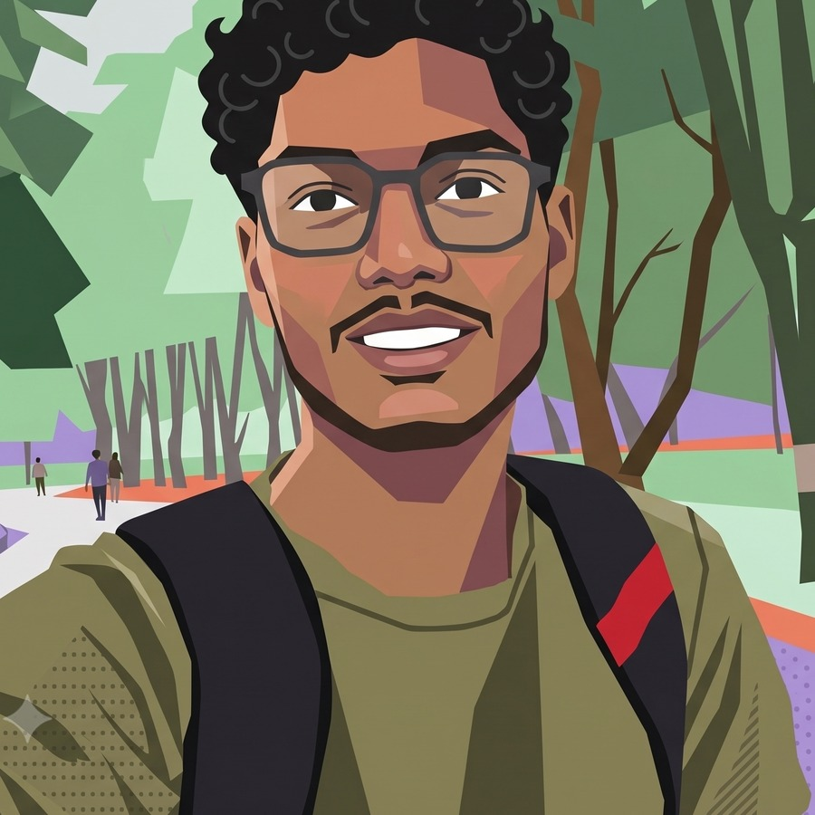

# Portfolio — researcher / engineer

A neo-brutalist personal site: hard borders, offset shadows, dotted background,
monospace body type, dark + light themes. Plain HTML, CSS and JavaScript — no
build step, no dependencies, no framework.

```
index.html          Home — hero, affiliations, "base of operations",
                    focus areas, current research, things built
research.html       Current research in depth, labs & affiliations, publications
projects.html       CILADO case study + lab work
experience.html     CV — experience, education, skills
assets/css/style.css
assets/js/main.js
assets/img/         Portrait placeholders + favicon
```

## Run it

Any static server works:

```bash
python3 -m http.server 4321
```

Then open <http://localhost:4321>. Or just double-click `index.html`.

## Content status

The content is real, taken from Pranav's LinkedIn profile: the Indo–Swiss grant
work, the C3iHub/IIT Kanpur IoT security internship, CILADO, the Deep Learning Lab
volunteering, education and skills.

Still to fill in — search the HTML for `TODO`:

| Placeholder | Where |
|---|---|
| `hello@example.com` | header, footer and every CTA — swap for the address you want public |
| `https://github.com/` | header socials + Projects page button |
| `https://x.com/` | header socials (delete the link if you don't use X) |
| `Download CV (PDF)` | `experience.html` — drop the PDF in and point the link at it |
| Graduation year `2029` | `experience.html`, education section |
| Programming languages | `experience.html`, Skills card — I only had your LinkedIn skill tags |

## Personalising it

Everything is hand-editable HTML. The pieces you will want to change first:

| What | Where |
|---|---|
| Your name | `.brand__name` in the header + `<title>` + footer, on all four pages |
| Social links | `.socials` block in the header and footer (GitHub, Scholar, X, LinkedIn) |
| Email | search for `hello@example.com` |
| Résumé / CV PDF | the `Download CV` and `Resume` links (`href="#"`) |
| Publications | `research.html` has a commented-out `.pub` template in the Publications card — uncomment it when you have a paper |
| Your name in an author list | wrap it in `<span class="me">…</span>` to highlight it |
| Research projects | `.case` blocks in `research.html` |
| Experience & education | `.tl-item` blocks in `experience.html`; add `is-current` to the ongoing one for a green dot |
| Projects | `.case` (long form) and `.project` (cards) in `projects.html` |
| The purple "new" dot on a nav item | the `data-dot` attribute on a `.nav__link` — delete it to remove |

### The portrait

The hero photo is the cursor-reveal: an illustration on top, your real photograph
underneath, and moving the cursor over it opens a circular window onto the photo.
On touch screens, tapping the image toggles the whole photo instead.

Replace the two files in `index.html`:

```html


```

Both are 900×900 crops of your own photos. **Both were flipped horizontally** — the
original selfie came out of the front camera mirrored, so the text on your shirt and
backpack read backwards. Flipping both keeps them in register with each other and
makes the text read correctly. The crops are aligned on the eye line so the face
does not jump when the reveal circle passes over it.

If you swap in new images, use square (1:1) crops with the face in the same place in
both, or the effect will shift.

To change how big the reveal circle is, edit the `0.33` multiplier in
`initPortrait()` in `assets/js/main.js`.

### Colours and type

All design tokens live at the top of `assets/css/style.css`, in `:root` (dark) and
`[data-theme="light"]`:

```css
--orange: #e8734a;   /* primary accent, buttons          */
--purple: #a78bda;   /* "base of operations" card        */
--green:  #2f9e5f;   /* badge + the scroll progress bar  */
--yellow: #f5d547;   /* CTA block, theme toggle          */
--bw: 3px;           /* border width  */
--sh: 6px;           /* shadow offset */
```

Fonts are Archivo Black (headings) and JetBrains Mono (everything else), loaded
from Google Fonts in each page's `<head>`, with system fallbacks if that fails.

## What the JavaScript does

`assets/js/main.js` is ~200 lines and dependency-free:

- **Theme toggle** — remembers the choice in `localStorage`, defaults to your OS setting.
- **Scroll progress** — fills the header with green as you move down the page.
- **Cursor ring** — a small ring that follows the pointer and grows over links (desktop only).
- **Portrait reveal** — the circular window described above.
- **Reveal on scroll** — fade-and-rise as sections enter the viewport.
- **The cat** — see below.

It degrades safely: with JavaScript disabled every section is visible, and
`prefers-reduced-motion: reduce` turns off the animations.


## The cat

There is a cat sitting on the top edge of the footer on every page.

- In **dark mode** she is asleep — eyes shut, `z z z` drifting up.
- In **light mode** she is awake and blinks every few seconds.
- **Click her** and she meows. Repeated clicks cycle through `meow!`, `mrrp?`,
  `purr…`, `mew!`, `meowww`, `…prrp`. Petting her while she is asleep wakes her
  for about four seconds, then she dozes off again.

She is an inline SVG in the footer of each page, styled in section 21 of
`style.css` and wired up by `initCat()` in `main.js`. She uses the same palette
tokens as everything else, so re-skinning the site re-skins the cat. She is hidden
when printing, and all her animation stops under `prefers-reduced-motion: reduce`.

To resize her, change `.cat__svg { width: … }`. To move her to the other side,
swap `right` for `left` on `.cat`. To remove her entirely, delete the
`<div class="cat" data-cat>` block from each page — nothing else depends on it.

## Deploying

It is four HTML files and a folder. Drag the directory onto Netlify, push it to a
GitHub Pages branch, or point any static host at it. Nothing to build.
